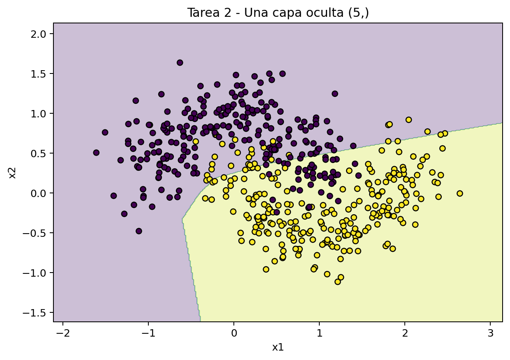
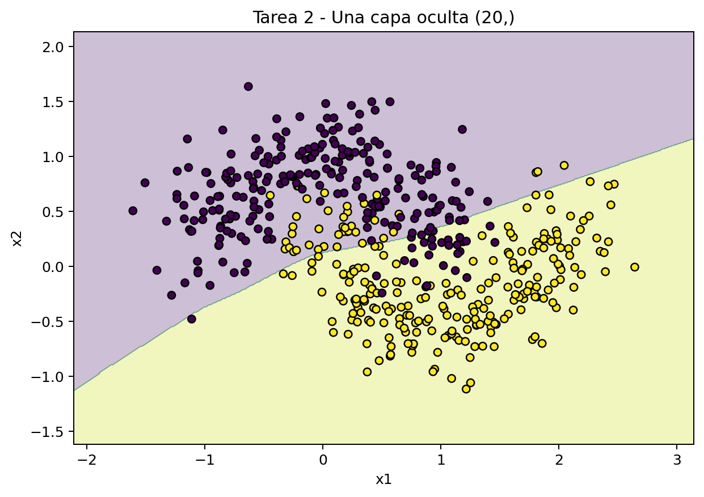
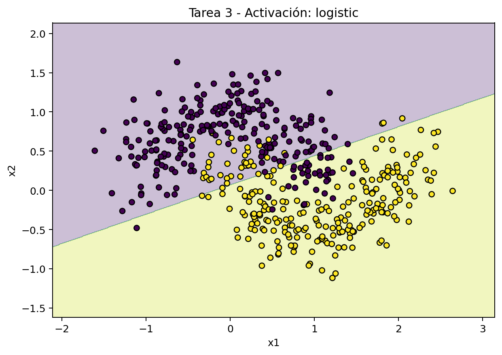
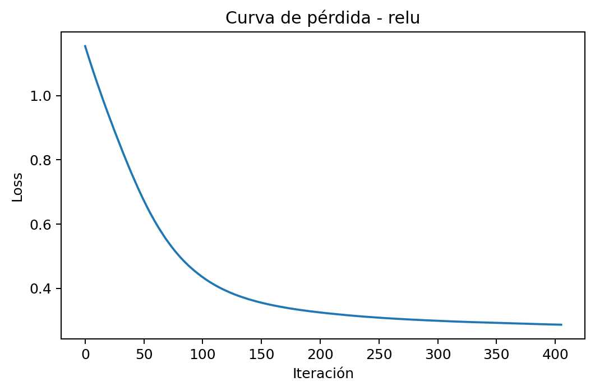

# Práctica 5: Arquitectura de Redes Neuronales (MLP)

## Introducción al Aprendizaje Automático
**3º Ingeniería Informática - Curso 2025/2026**

---

## Objetivo
Comprobar cómo la arquitectura de un Perceptrón Multicapa afecta a su capacidad de representación y de generalización. La práctica estudia tres ideas: por qué un modelo lineal falla en datos no lineales, cómo cambia la frontera de decisión al variar el número de neuronas, y qué efecto tiene la función de activación sobre el entrenamiento.

---

## Material de partida
- Dataset sintético no lineal basado en `make_moons`.
- Dataset de dígitos escritos a mano (`load_digits`).
- Plantilla de código en Python con `scikit-learn`.

> Nota: el trabajo consiste en analizar resultados experimentales, no en implementar una red neuronal desde cero.

---

## Introducción
En problemas reales la separación entre clases rara vez es una recta. Un modelo lineal solo puede construir una frontera de decisión simple, por lo que fracasa cuando las clases están organizadas con curvatura o estructuras más complejas.

Los MLP resuelven esta limitación al combinar capas ocultas y funciones de activación no lineales. Eso les permite aprender fronteras más expresivas, pero también obliga a decidir con criterio cuánta capacidad usar, porque una arquitectura demasiado simple se queda corta y una demasiado grande puede complicar el entrenamiento sin aportar una mejora clara.

---

## Tarea 1: El problema de la no linealidad

En esta parte se usa un perceptrón simple, es decir, un MLP sin capas ocultas. El resultado en `make_moons` es limitado porque el modelo solo puede aprender una frontera lineal.

### Resultados

| Modelo | Arquitectura | Activación | acc_train | acc_test | Iteraciones |
| --- | --- | --- | --- | --- | --- |
| Perceptrón simple | `()` | `relu` | 0.8286 | 0.8200 | 1603 |

La matriz de confusión y la frontera aprendida se muestran a continuación:

### Pregunta
¿Por qué falla este modelo en este problema?

### Respuesta
El modelo falla porque un perceptrón simple solo construye una frontera lineal. En `make_moons`, las dos clases no están separadas por una recta, sino que forman dos medias lunas entrelazadas. Por eso una combinación lineal de las variables de entrada no es suficiente para separar correctamente las clases.

### Pregunta
¿Qué relación hay entre la geometría de los datos, la frontera de decisión y la capacidad expresiva del modelo?

### Respuesta
- La forma geométrica de los datos es no lineal y curvada, no separable por una recta.
- La frontera de decisión aprendida por el modelo es lineal, así que no puede seguir esa curvatura.
- La capacidad expresiva del modelo es baja porque no tiene capas ocultas que introduzcan no linealidad.

---

## Tarea 2: Diseñando la capa oculta

Se comparan tres configuraciones con una sola capa oculta: 2, 5 y 20 neuronas. La idea es observar cómo crece la flexibilidad del modelo y si esa flexibilidad mejora realmente la generalización.

### Resultados

| Modelo | Arquitectura | acc_train | acc_test | Iteraciones |
| --- | --- | --- | --- | --- |
| MLP(2,) | `(2,)` | 0.8429 | 0.8200 | 648 |
| MLP(5,) | `(5,)` | 0.8686 | 0.8400 | 726 |
| MLP(20,) | `(20,)` | 0.8600 | 0.8533 | 406 |

Las fronteras de decisión obtenidas son:

### Pregunta
¿Cómo cambia la frontera de decisión al aumentar el número de neuronas ocultas?

### Respuesta
- Con 2 neuronas la frontera sigue siendo demasiado simple y deja mucha estructura sin capturar.
- Con 5 neuronas mejora algo la separación, pero todavía no representa bien la geometría real del problema.
- Con 20 neuronas la frontera se adapta mejor a las medias lunas y la accuracy de prueba es la mejor de las tres configuraciones (`0.8533`).
- No aparece una frontera claramente irregular o sobreajustada; el problema sigue dominado por la falta de capacidad en los modelos pequeños.

### Pregunta
¿Hay underfitting u overfitting en estas configuraciones?

### Respuesta
- Hay underfitting en las arquitecturas más simples, especialmente con 2 neuronas.
- Aumentar neuronas mejora la capacidad de representación y acerca la frontera al patrón real.
- En estos experimentos no se ve un overfitting fuerte, así que la mejora viene de aumentar flexibilidad, no de memorizar ruido.

`resultados/tarea2_hidden_layer.csv` contiene la tabla generada por el script.

---

## Tarea 3: Funciones de activación

Aquí se fija la misma arquitectura `(20,)` y se comparan dos activaciones: `logistic` como sigmoide y `relu`.

### Resultados

| Activación | acc_test | Iteraciones | loss_final |
| --- | --- | --- | --- |
| logistic | 0.8400 | 485 | 0.3071 |
| relu | 0.8533 | 406 | 0.2870 |

Las curvas de pérdida y las fronteras de decisión son:

### Pregunta
¿Cuál de las dos funciones converge más rápido y qué diferencias se observan?

### Respuesta
- ReLU converge más rápido: necesita menos iteraciones (`406` frente a `485`).
- La estabilidad del entrenamiento es algo mejor con ReLU, porque la pérdida baja antes y con menos bloqueo por saturación.
- La frontera de decisión de ReLU y la de sigmoide son parecidas, pero ReLU ajusta un poco mejor la separación y da mejor accuracy de prueba.

### Pregunta
¿Por qué puede ocurrir lo observado?

### Respuesta
La sigmoide tiende a saturarse, lo que ralentiza el aprendizaje y puede dificultar el ajuste fino. ReLU es más fácil de optimizar y suele producir una convergencia más rápida. En esta práctica la diferencia no es enorme, pero sí consistente: ReLU ofrece un aprendizaje más ágil y una ligera mejora en test.

La comparación también confirma que la activación debe estudiarse manteniendo fija la arquitectura, porque si cambian ambas cosas a la vez no se puede aislar el efecto real de la función de activación.

`resultados/tarea3_activation_comparison.csv` guarda el resumen numérico.

---

## Tarea 4: El reto de la caja negra

Se evalúa el dataset de dígitos con distintas arquitecturas. La meta es alcanzar al menos un 95% de accuracy en prueba con una arquitectura razonable.

### Búsqueda inicial

| Modelo | Arquitectura | acc_train | acc_test | Iteraciones | Cumple 95% |
| --- | --- | --- | --- | --- | --- |
| MLP(20,) | `(20,)` | 1.0000 | 0.9644 | 276 | sí |
| MLP(50,) | `(50,)` | 1.0000 | 0.9711 | 180 | sí |
| MLP(100,) | `(100,)` | 1.0000 | 0.9800 | 147 | sí |
| MLP(30, 15) | `(30, 15)` | 1.0000 | 0.9600 | 161 | sí |
| MLP(50, 20) | `(50, 20)` | 1.0000 | 0.9756 | 131 | sí |
| MLP(64, 32) | `(64, 32)` | 1.0000 | 0.9667 | 110 | sí |

### Exploración ampliada

| Arquitectura | acc_test | Iteraciones | Cumple 95% |
| --- | --- | --- | --- |
| `(10,)` | 0.9578 | 404 | sí |
| `(20,)` | 0.9644 | 276 | sí |
| `(20, 10)` | 0.9600 | 204 | sí |
| `(20, 20)` | 0.9556 | 180 | sí |
| `(20, 50)` | 0.9400 | 143 | no |

`resultados/tarea4_digits.csv` y `resultados/digits_grid_opcional.csv` contienen los detalles completos.

### Pregunta
¿Qué arquitectura alcanza al menos un 95% de acierto?

### Respuesta
El problema de dígitos necesita más capacidad que `make_moons`, pero no requiere una red especialmente profunda para superar el 95%. Una sola capa oculta ya basta si tiene suficientes neuronas. La arquitectura `(10,)` alcanza el objetivo con la menor complejidad probada, aunque necesita más iteraciones que `(20,)`.

### Pregunta
¿Es preferible una sola capa con muchas neuronas o dos capas con menos neuronas cada una?

### Respuesta
- En este caso es preferible una sola capa con neuronas suficientes antes que aumentar la profundidad sin necesidad.
- Las redes más anchas funcionan bien y, en esta búsqueda, ya cumplen el objetivo con menos complejidad estructural.
- Dos capas pueden ser útiles, pero aquí no aportan una mejora decisiva frente a una sola capa bien dimensionada.

### Pregunta
¿Qué compromiso hay entre simplicidad, capacidad de representación, dificultad de entrenamiento, interpretabilidad y rendimiento?

### Respuesta
El compromiso más razonable es mantener la red lo bastante simple para que entrene bien y lo bastante grande para superar el 95%.

### Pregunta
¿Qué arquitectura final seleccionas para la entrega?

### Respuesta
Si el criterio principal es simplicidad mínima, `(10,)` es suficiente. Si se busca un equilibrio mejor entre simplicidad, margen sobre el 95% y coste de entrenamiento, la opción que recomiendo es `(20,)`, porque sigue siendo muy compacta y converge en menos iteraciones que `(10,)`.

---

## Decisión final de diseño

### Pregunta
¿Cuándo tiene sentido usar una red sin capas ocultas y cuándo no?

### Respuesta
Tiene sentido usar una red sin capas ocultas cuando el problema es casi lineal o cuando se busca una base muy simple e interpretable. No tiene sentido cuando la frontera real es claramente no lineal.

### Pregunta
¿Qué arquitectura recomendarías para un problema no lineal sencillo?

### Respuesta
Para un problema no lineal sencillo recomendaría una arquitectura pequeña con una sola capa oculta, como `(20,)`, porque ya mejora claramente al modelo lineal sin complicar demasiado el entrenamiento.

### Pregunta
¿Qué ventajas e inconvenientes observas al aumentar el número de neuronas?

### Respuesta
Aumentar el número de neuronas da más capacidad de representación, pero también incrementa el riesgo de complejidad innecesaria y el coste de entrenamiento. Si se pasa de cierto punto, la mejora ya es marginal.

### Pregunta
¿Qué función de activación elegirías en un problema general de clasificación y por qué?

### Respuesta
En un problema general de clasificación elegiría ReLU, porque suele converger mejor y evita parte de la saturación de la sigmoide.

### Pregunta
¿Qué criterio usarías para decidir si una arquitectura es suficientemente buena sin hacerla innecesariamente compleja?

### Respuesta
Usaría como criterio la arquitectura más simple que alcance el rendimiento objetivo con estabilidad, sin forzar profundidad o anchura extra si no aportan una mejora clara.

### Respuesta final
Para un problema no lineal sencillo, una red sin capas ocultas no es adecuada porque su frontera es esencialmente lineal. La primera mejora sensata es una arquitectura pequeña con una sola capa oculta. En esta práctica, esa solución ya supera claramente el rendimiento del perceptrón simple.

Si el problema es más complejo, puede tener sentido aumentar neuronas o usar dos capas, pero antes conviene comprobar si una red más ancha y simple ya resuelve el objetivo. En estos experimentos, la profundidad adicional no fue necesaria para llegar al 95% en dígitos.

En clasificación general, ReLU es la elección más práctica porque optimiza mejor y evita parte de la saturación que sí aparece con la sigmoide. La mejor arquitectura no es la que más acierta, sino la más simple que cumple el objetivo con estabilidad y margen suficiente.

---

## Conclusión

La práctica muestra que la arquitectura importa tanto como el algoritmo de entrenamiento. Un modelo lineal falla en problemas no lineales porque no tiene la capacidad geométrica necesaria. Una capa oculta añade expresividad y mejora la frontera de decisión. La activación influye en la velocidad y en la estabilidad del aprendizaje. Y, en dígitos, una red compacta ya puede alcanzar el umbral pedido sin necesidad de complicar demasiado el modelo.

En resumen, una red neuronal no es una caja mágica: su comportamiento depende de decisiones concretas de diseño, y la elección correcta suele ser la más simple que resuelve el problema con garantías.
