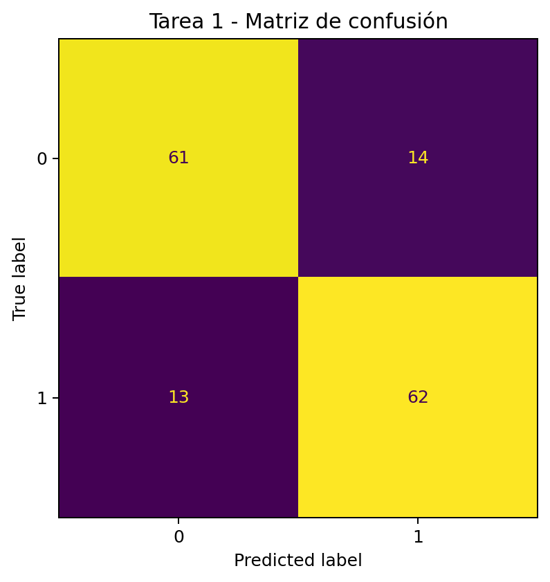
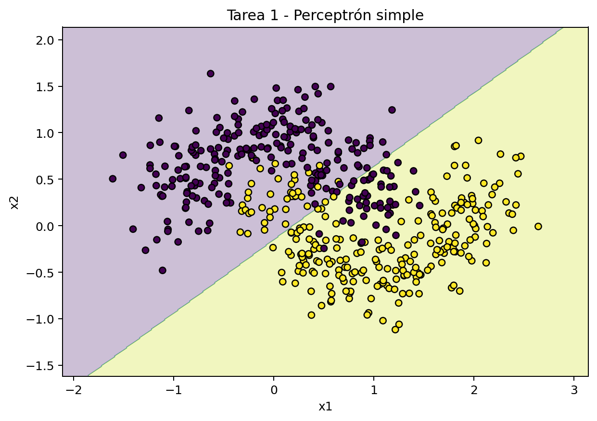
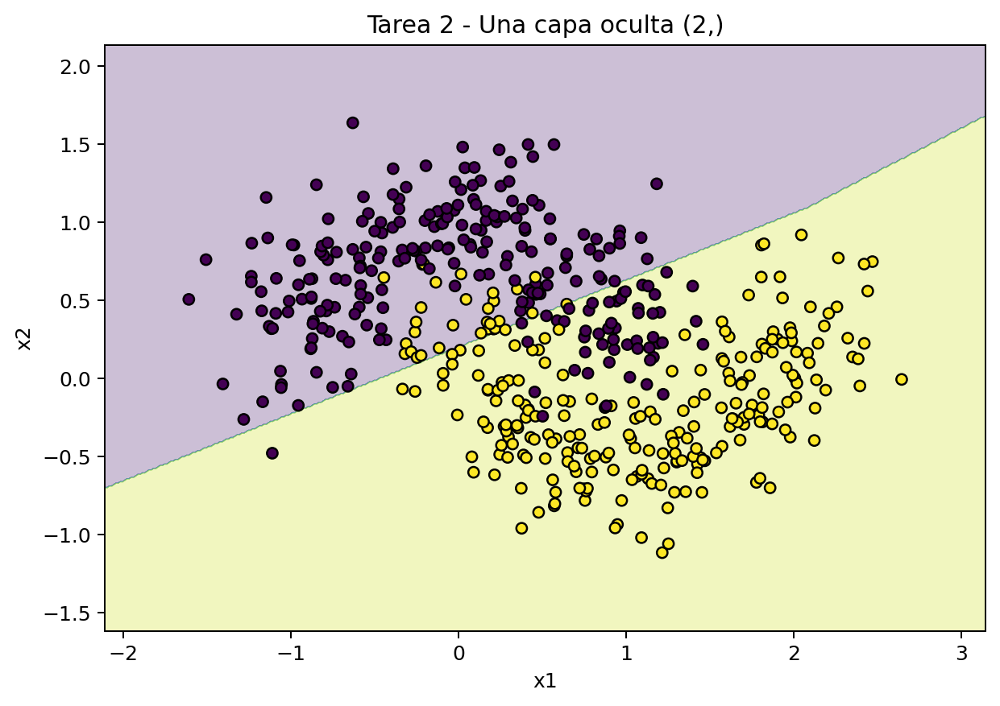
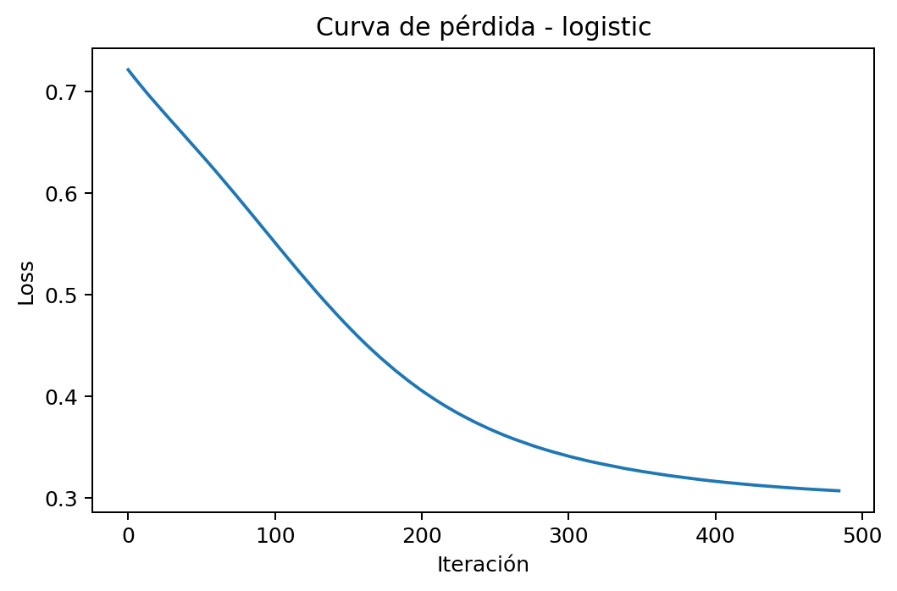
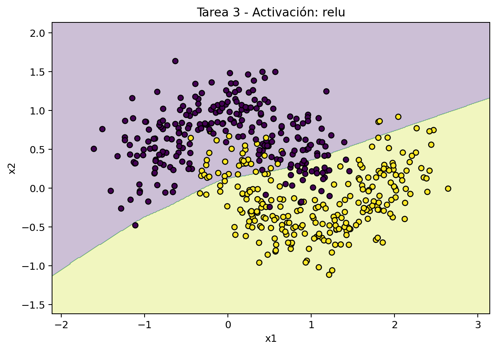

# Práctica 5: Arquitectura de Redes Neuronales (MLP)

## Introducción al Aprendizaje Automático
**3º Ingeniería Informática - Curso 2025/2026**

---

## Objetivo
Comprender cómo la arquitectura de una red neuronal afecta a su capacidad de representación y generalización. En particular, se estudiará por qué un modelo lineal falla en problemas no lineales, cómo influye el número de neuronas y capas ocultas en la frontera de decisión, y qué papel juegan las funciones de activación en el aprendizaje de un Perceptrón Multicapa.

---

## Material de partida
- Dataset sintético no lineal basado en `make_moons`.
- Dataset de dígitos escritos a mano (`load_digits`).
- Plantilla de código en Python con `scikit-learn`.

> Nota: el trabajo consiste en analizar resultados experimentales, no en implementar una red neuronal desde cero.

---

## Introducción
En prácticas anteriores se ha trabajado con modelos lineales o con clasificadores cuya capacidad de decisión era relativamente limitada. Sin embargo, muchos problemas reales presentan fronteras entre clases que no pueden representarse mediante una línea recta o un hiperplano simple.

Las redes neuronales permiten superar esta limitación mediante la combinación de capas y funciones de activación no lineales. Gracias a ello, un Perceptrón Multicapa (MLP) puede aprender regiones de decisión más complejas y adaptarse a problemas donde los modelos lineales fracasan.

Pero esta mayor flexibilidad también introduce nuevas preguntas de ingeniería:
- ¿Cuántas capas ocultas hacen falta?
- ¿Cuántas neuronas conviene usar?
- ¿Qué función de activación resulta más adecuada?
- ¿Cuándo un modelo empieza a ajustarse demasiado a los datos y pierde capacidad de generalización?

En esta práctica se va a explorar estas cuestiones de forma experimental, observando cómo cambia el comportamiento del modelo al modificar su arquitectura.

---

## Tarea 1: El problema de la no linealidad

### Descripción de la tarea
En esta parte se usa un perceptrón simple, es decir, un MLP sin capas ocultas. El resultado en `make_moons` es limitado porque el modelo solo puede aprender una frontera lineal.

### Cuestiones
#### ¿Por qué falla un modelo sin capas ocultas en este problema?

  Falla porque un perceptrón simple solo puede aprender fronteras de decisión lineales, mientras que make_moons tiene una distribución no lineal. Como no puede adaptarse a la forma curva de los datos, el modelo no puede separar bien las clases y tiene una cantidad considerable de errores.

#### ¿Qué relación hay entre la geometría de los datos, la frontera de decisión y la capacidad expresiva del modelo?

  La geometría de los datos determina como de compleja es la frontera  que separa las clases. Si los datos no son linealmente separables, se tiene que usar una frontera no lineal. La capacidad expresiva del modelo es la que define el tipo de fronteras que puede aprender el modelo. En este caso, el modelo solo puede representar fronteras lineales, por lo que no puede ajustarse a la estructura real de los datos, lo que provoca que haya underfitting.

### Resultados
[Escribe aquí el resumen de los resultados obtenidos en esta tarea.]

- Accuracy en entrenamiento: 82.86%
- Accuracy en prueba: 82.00%
- Iteraciones: 1603

### Figuras
- Matriz de confusión:

- Frontera de decisión:

---

## Tarea 2: Diseñando la capa oculta

### Descripción de la tarea
Se comparan tres configuraciones con una sola capa oculta: 2, 5 y 20 neuronas. La idea es observar cómo crece la flexibilidad del modelo y si esa flexibilidad mejora realmente la generalización.

### Cuestiones
#### ¿Qué ocurre al aumentar el número de neuronas en una sola capa oculta?

  Al aumentar el número de neuronas en una sola capa oculta, el modelo gana capacidad para aprender fronteras de decisión más complejas.
  Con pocas neuronas, la red suele quedarse corta (underfitting) y no captura bien la forma no lineal de los datos; al añadir neuronas, normalmente mejora la accuracy y la frontera se ajusta mejor.

  Sin embargo, más neuronas no siempre implica mejor generalización: si se incrementan en exceso, aumenta la complejidad del modelo y puede aparecer sobreajuste o mejoras marginales que no compensan el coste.
  La idea clave es buscar un punto intermedio: suficientes neuronas para representar el problema, pero sin sobredimensionar la red.

#### ¿Cómo cambia la frontera de decisión al aumentar el número de neuronas ocultas?

  Al aumentar el número de neuronas ocultas, la frontera de decisión pasa de ser más simple y rígida a ser más flexible y detallada.

  Con pocas neuronas, la frontera suele ser demasiado “suave” y no captura bien la curvatura de los datos (underfitting). Al añadir neuronas, aparecen más regiones de separación y el modelo se adapta mejor al patrón no lineal, mejorando normalmente el rendimiento en test. Si se añaden demasiadas, la frontera puede volverse innecesariamente compleja e irregular, ajustándose al ruido y perdiendo capacidad de generalización (overfitting).

#### ¿Hay underfitting u overfitting en estas configuraciones?

  En estas configuraciones se observa principalmente underfitting en las redes pequeñas y una reducción de ese problema al aumentar neuronas:
  - Con 1 capa y 2 neuronas hay underfitting claro: la frontera es demasiado simple y no captura bien la curvatura de los datos.
  - Con 1 capa y 5 neuronas el ajuste mejora, pero todavía puede haber cierto underfitting (la frontera sigue siendo algo limitada).
  - Con 1 capa y 20 neuronas el modelo representa mejor la no linealidad y el underfitting disminuye notablemente.

### Resultados
[Escribe aquí el resumen de los resultados obtenidos en esta tarea.]

| Modelo | Arquitectura | acc_train | acc_test | Iteraciones |
| --- | --- | --- | --- | --- |
| MLP 1 capa (2) | 1 capa (2 neuronas) | 0.8429 | 0.8200 | 648 |
| MLP 1 capa (5) | 1 capa (5 neuronas) | 0.8686 | 0.8400 | 726 |
| MLP 1 capa (20) | 1 capa (20 neuronas) | 0.8600 | 0.8533 | 406 |

### Figuras
- Frontera de decisión con 2 neuronas: 

- Frontera de decisión con 5 neuronas: 

- Frontera de decisión con 20 neuronas: 

---

## Tarea 3: Funciones de activación

### Descripción de la tarea
En esta parte se estudiará cómo influye la función de activación de las capas ocultas. Se elegirá una arquitectura fija y se entrenará dos veces: una con Sigmoide y otra con ReLU. Luego se compararán ambos modelos en términos de evolución del entrenamiento, iteraciones necesarias, rendimiento final y aspecto de la frontera de decisión.

### Cuestiones
#### ¿Cuál de las dos funciones converge más rápido y qué diferencias se observan?

  La función de activación ReLU converge más rápido que la función logístiac, ya que necesita menos iteraciones para alcanzar un valor de pérdida bajo (406 frente a 485 iteraciones).

  Además, ReLU obtiene un mejor rendimiento final, con mayor accuracy en test (0.8533 frente a 0.8400) y menor valor de pérdida final (0.2870 frente a 0.3071).

  En las curvas de pérdida se puede ver que:

  Con logistic, la disminución de la pérdida es progresiva y lenta.
  Con ReLU, la pérdida cae rápidamente en las primeras iteraciones y converge antes.

  En cuanto a la frontera de decisión, ambas son similares en forma general, pero ReLU produce una separación ligeramente más ajustada a los datos y Logistic genera una frontera algo mas suave, con mayor solapamiento en algunas zonas.

  En resumen, ReLU tiene un comportamiento mas eficiente en velocidad de convergencia y en calidad del resultado final.

#### ¿Por qué puede ocurrir lo observado?

  La función logística no funciona correctamente cuando los valores de entrada son muy altos o muy bajos, lo que provoca gradientes muy cerca de cero. Esto provoca que el aprendizaje sea lento, ya que los pesos se actualizan muy poco en esas zonas.

  En cambio, ReLU no se satura para valores positivos y mantiene gradientes constantes, lo que hace que el entrenamiento sea mas eficiente.

  ReLU permite una optimización más rápida y estable, reduce el problema del gradiente desvanecido y facilita que el modelo aprenda mejores representaciones en menos iteraciones.

  Esto explica por qué, en este experimento, ReLU converge antes y el porque alcanza un mejor rendimiento final.

### Resultados
[Escribe aquí el resumen de los resultados obtenidos en esta tarea.]

| Activación | acc_test | Iteraciones | loss_final |
| --- | --- | --- | --- |
| logistic | 0.8400 | 485 | 0.3071 |
| relu | 0.8533 | 406 | 0.2870 |

### Figuras
- Frontera con logistic:

- Pérdida con logistic:

- Frontera con ReLU:

- Pérdida con ReLU: [insertar figura]

---

## Tarea 4: El reto de la caja negra

### Descripción de la tarea
Se trabajará con un problema más realista: clasificación de dígitos escritos a mano. Se cargará el dataset de dígitos y se diseñarán distintas arquitecturas MLP variando el número de capas ocultas y neuronas por capa, buscando una configuración que alcance al menos un 95% de acierto.

No se trata de probar combinaciones al azar: se justificará el proceso seguido, se explicará qué arquitecturas se probaron, cuáles funcionaron mejor o peor, y cuál se considera la configuración mínima razonable.

### Cuestiones
#### ¿Qué arquitectura alcanza al menos un 95% de acierto? Justifica el proceso experimental seguido.

  La arquitectura mínima razonable que alcanzó al menos un 95% de acierto fue una MLP de 1 capa oculta con 10 neuronas, con acc_test = 0.9578 (en la exploración ampliada).
    El proceso seguido fue incremental y justificado: primero se probaron arquitecturas base de 1 capa (20, 50 y 100 neuronas) y de 2 capas (30-15, 50-20 y 64-32), y después se amplió con configuraciones más pequeñas para identificar el umbral mínimo que cumplía el objetivo.

  En conjunto:
  - Funcionaron mejor en accuracy arquitecturas más grandes como una capa de 100 neuronas (aprox. 0.98), pero con mayor complejidad.
  - Varias configuraciones cumplieron el 95% (una capa de 20, 50 o 100 neuronas; dos capas 30-15, etc.).
  - Algunas configuraciones desbalanceadas rindieron peor (por ejemplo, dos capas 20-50 quedaron por debajo del 95%).

  Por tanto, si el criterio principal es cumplir 95% con la menor complejidad posible, la elección recomendada es 1 capa con 10 neuronas; si se prioriza un margen extra de rendimiento/estabilidad, una opción equilibrada es 1 capa con 20 neuronas.

#### ¿Es preferible una sola capa con muchas neuronas o dos capas con menos neuronas cada una?

  En este caso es preferible una sola capa con suficientes neuronas.
    
  Con los resultados de la práctica, una red de una sola capa ya supera el 95% en test y lo hace con una estructura más simple, más fácil de justificar y de ajustar. Las arquitecturas de dos capas también funcionan, pero no aportan una mejora clara y consistente que compense el aumento de complejidad.

#### ¿Qué compromiso existe entre simplicidad, capacidad de representación, dificultad de entrenamiento, interpretabilidad y rendimiento?

  El compromiso es que, al simplificar la arquitectura, se gana en interpretabilidad, estabilidad y coste de entrenamiento, pero se puede perder capacidad para modelar patrones complejos. Si se aumenta mucho la complejidad (más capas o más neuronas), la red suele representar mejor la estructura de los datos y puede subir el rendimiento, aunque a costa de mayor tiempo de ajuste, más sensibilidad a hiperparámetros y más riesgo de sobreajuste. Por eso, la decisión razonable no es “la red más grande”, sino la arquitectura más simple que alcance el objetivo (por ejemplo, 95% en test) con una brecha entrenamiento-prueba controlada y un comportamiento estable entre ejecuciones.

### Arquitectura final seleccionada

  Se recomienda una MLP de 1 capa oculta con 20 neuronas como opción final de diseño.
  Aunque la arquitectura de 1 capa con 10 neuronas ya supera el umbral del 95% en prueba, la configuración con 20 neuronas ofrece un margen adicional de rendimiento y estabilidad sin incrementar demasiado la complejidad del modelo.

  La elección se justifica por el equilibrio entre:
  - simplicidad estructural (fácil de entrenar y de mantener),
  - capacidad de representación suficiente para el problema de dígitos,
  - buen rendimiento en test con menor riesgo de sobrecomplicar la red frente a alternativas más grandes o más profundas.

  En resumen, se prioriza la arquitectura más simple que cumple holgadamente el objetivo, evitando aumentar capas o neuronas sin una mejora proporcional en generalización.

### Resultados
[Escribe aquí el resumen de los resultados obtenidos en esta tarea.]

| Modelo | Arquitectura | acc_train | acc_test | Iteraciones | Cumple 95% |
| --- | --- | --- | --- | --- | --- |
| MLP 1 capa (20) | 1 capa (20 neuronas) | 0.9993 | 0.9644 | 169 | sí |
| MLP 1 capa (50) | 1 capa (50 neuronas) | 1.0000 | 0.9711 | 180 | sí |
| MLP 1 capa (100) | 1 capa (100 neuronas) | 1.0000 | 0.9800 | 147 | sí |
| MLP 2 capas (30-15) | 2 capas (30 y 15 neuronas) | 1.0000 | 0.9600 | 161 | sí |

---

## Reto: Decisión final de diseño

### Descripción de la tarea
Imagina que formas parte de un equipo técnico que necesita desplegar un clasificador basado en redes neuronales para un problema real. Debes redactar una breve propuesta respondiendo a las preguntas. Se valorará especialmente la capacidad de conectar los resultados experimentales con una decisión de diseño razonada.

### Cuestiones
#### ¿Cuándo tiene sentido usar una red sin capas ocultas y cuándo no?

  - Tiene sentido usar una red sin capas ocultas cuando el problema es aproximadamente lineal, hay poca complejidad en los datos, se busca un modelo muy simple e interpretable, o se necesita una línea base rápida para comparar. En esos casos, un perceptrón simple puede ser suficiente y además es más fácil de entrenar y justificar.

  - No tiene sentido usarla cuando la frontera entre clases es no lineal (como en make_moons), cuando hay interacciones complejas entre variables o cuando se observa underfitting claro. En esos escenarios, el modelo sin capas ocultas queda limitado porque solo aprende separaciones lineales, por lo que conviene añadir al menos una capa oculta para ganar capacidad de representación y mejorar la generalización.

#### ¿Qué arquitectura recomendarías para un problema no lineal sencillo?

  Para un problema no lineal sencillo recomendaría una MLP con 1 capa oculta y unas 20 neuronas, usando ReLU.

  Esto se debe a que:
  - Tiene suficiente capacidad para modelar fronteras no lineales sin complicar demasiado el modelo.
  - Mantiene un buen equilibrio entre rendimiento, coste de entrenamiento e interpretabilidad.
  - En los resultados, esta configuración mejora claramente frente a redes más pequeñas y evita sobredimensionar la arquitectura.

  Si el objetivo fuese solo cumplir un umbral mínimo con la menor complejidad posible, también sería razonable 1 capa con 10 neuronas.

#### ¿Qué ventajas e inconvenientes observas al aumentar el número de neuronas?

  Al aumentar el número de neuronas, las principales ventajas son una mayor capacidad de representación y, por tanto, la posibilidad de aprender fronteras de decisión más complejas. Esto suele reducir el underfitting y puede mejorar la accuracy, especialmente cuando el problema es claramente no lineal.

  Como inconvenientes, también aumenta la complejidad del modelo: el entrenamiento puede tardar más, la optimización se vuelve más sensible a hiperparámetros y crece el riesgo de sobreajuste si la red empieza a ajustarse al ruido. Además, se pierde interpretabilidad y puede haber mejoras marginales que no compensen el coste añadido.

  En resumen, no conviene “poner más neuronas por defecto”, sino buscar el mínimo tamaño de red que consiga buen rendimiento en test de forma estable.

#### ¿Qué función de activación elegirías en un problema general de clasificación y por qué?

  En un problema general de clasificación elegiría ReLU en las capas ocultas, porque suele converger más rápido, facilita la optimización con gradientes y, en la práctica, ofrece buen rendimiento con menor riesgo de saturación que la sigmoide. Ya que aunque la sigmoide puede funcionar, tiende a saturarse en valores extremos, lo que ralentiza el aprendizaje y puede requerir más iteraciones para llegar a un resultado similar. Por eso, como elección por defecto, ReLU suele ser más robusta y eficiente.

#### ¿Qué criterio usarías para decidir si una arquitectura es suficientemente buena sin hacerla innecesariamente compleja?

  [Escribe aquí tu respuesta.]

---

## Conclusión
[Redacta aquí una conclusión breve sobre el papel de la arquitectura, la función de activación y el compromiso entre simplicidad y rendimiento. Reflexiona sobre por qué una red neuronal no es una caja mágica, sino una familia de modelos cuyo comportamiento depende de decisiones concretas de diseño: arquitectura, activación y equilibrio entre ajuste y generalización.]
