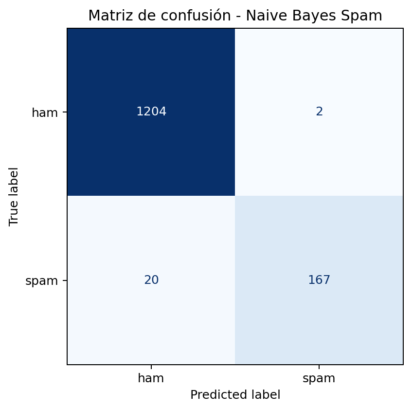

<h1 style="margin-top: -5px;">Práctica 6: Clasificación de Texto y Filtros Anti-Spam (Naive Bayes)</h1>

<h2 style="margin-top: -5px;">Introducción al Aprendizaje Automático</h2>

<strong>3º Ingeniería Informática - Curso 2025/2026</strong>

## Objetivo
Comprender cómo un modelo probabilístico puede clasificar texto a partir de la frecuencia de las palabras. En particular, se estudiará cómo representar mensajes mediante una bolsa de palabras, cómo aplica
el clasificador Naïve Bayes el Teorema de Bayes para distinguir entre mensajes legítimos y spam, y por qué el suavizado de Laplace resulta esencial cuando aparecen términos no vistos durante el entrenamiento.

## Material de partida

Se proporciona:

- Un dataset real de mensajes SMS etiquetados como ham o spam, descargado de Kaggle.
- Una plantilla de código base en Python con pandas y scikit-learn, para facilitar la carga de datos, la vectorización del texto y el entrenamiento inicial del modelo.
- Un problema de clasificación binaria en el que el objetivo es decidir si un mensaje es legítimo o no deseado a partir de su contenido textual.

## Introducción
En problemas de clasificación de texto, los datos de entrada no son números ni vectores geométricos sencillos, sino mensajes escritos en lenguaje natural. Antes de poder aplicar un algoritmo de aprendizaje automático, es necesario transformar ese texto en una representación numérica que el modelo pueda manejar.

Una estrategia clásica consiste en usar una bolsa de palabras (Bag of Words), donde cada mensaje se representa mediante el recuento de las palabras que contiene. A partir de esa representación, un clasificador como Naive Bayes puede estimar qué palabras aparecen con mayor frecuencia en los mensajes spam y cuáles son más habituales en mensajes legítimos.

Este enfoque es especialmente interesante porque, aunque es sencillo, permite introducir varias ideas fundamentales del aprendizaje automático: la necesidad de preprocesar los datos antes de entrenar un modelo; la conversión de información textual en variables numéricas; el uso de probabilidades para clasificar ejemplos; y la importancia de evitar problemas numéricos mediante técnicas como el suavizado de Laplace.

En esta práctica se va a trabajar con estas ideas de forma experimental, observando cómo un modelo puede aprender a detectar patrones de lenguaje asociados al spam.

<h2 style="margin-top: -15px;">Tarea 1: Del texto a los números</h2>

<h3 style="margin-top: -15px; margin-bottom: -5px;">Qué se hizo</h3>

- Se cargó el dataset de mensajes SMS desde el archivo spam.csv y se verificaron las columnas Category y Message.
- Se transformaron las etiquetas a formato numérico para clasificación binaria: ham -> 0 y spam -> 1.
- Se aplicó un preprocesamiento básico al texto: conversión a minúsculas, eliminación de signos/símbolos no alfanuméricos y normalización de espacios.
- Se dividió el conjunto de datos en entrenamiento y prueba con partición estratificada para conservar la proporción de clases (test_size = 0.25, random_state = 42).
- Se vectorizó el texto con Bag of Words usando CountVectorizer, obteniendo una matriz documento-término para entrenar y evaluar el modelo.

<h3> Cuestión </h3> <strong style="margin-top: -15px; display: inline-block;">¿Por qué es necesario transformar los mensajes de texto a una representación numérica tipo Bag of Words antes de entrenar Naive Bayes, y qué información se conserva o se pierde con esta transformación? </strong>

Esta transformación es necesaria debido a que Naive Bayes opera con variables numéricas y necesita contar evidencias para estimar probabilidades por clase. Con Bag of Words, cada mensaje se convierte en un vector de frecuencias de palabras, lo que conserva información léxica clave: qué términos aparecen y cuántas veces, algo muy útil para distinguir patrones típicos de spam y ham.

Sin embargo, se pierde el orden exacto de las palabras y parte del contexto gramatical o semántico. Por eso, mensajes con las mismas palabras pero en distinto orden pueden quedar representados de forma muy parecida. En resumen, Bag of Words simplifica el texto para hacerlo tratable por el modelo, manteniendo señal útil para clasificar, aunque sacrificando información de estructura lingüística.

### Reflexión sobre la matriz documento-término
 <strong style="margin-top: -15px; display: inline-block;">¿Qué representa cada elemento de la matriz documento-término (filas, columnas y valores) y cómo condiciona esta representación lo que el modelo puede aprender? </strong>

En la matriz documento-término, cada fila corresponde a un mensaje concreto del dataset, cada columna corresponde a una palabra del vocabulario total y cada valor indica cuántas veces aparece esa palabra en ese mensaje.

Esta representación convierte texto en números y permite que el clasificador compare patrones de frecuencia entre mensajes ham y spam. Por tanto, el modelo aprende asociaciones entre palabras y clases, por ejemplo qué términos son más habituales en spam.

Sin embargo, también impone límites: al trabajar con recuentos, se pierde el orden de las palabras y parte del contexto lingüístico. Eso significa que el modelo capta bien señales léxicas, pero no entiende la estructura completa de la frase. En resumen, la forma de representar los datos determina directamente qué información aprovecha el modelo y qué información queda fuera del aprendizaje.

<h2 style="margin-top: -15px;">Tarea 2: Entrenando el clasificador Naive Bayes</h2>

<h3 style="margin-top: -15px; margin-bottom: -5px;">Qué se hizo</h3>

- Se entrenó un clasificador **Multinomial Naïve Bayes** sobre la representación Bag of Words obtenida en la Tarea 1.
- Se configuró el hiperparámetro **alpha = 1.0** para aplicar suavizado de Laplace.
- Se ajustó el modelo con el conjunto de entrenamiento (`fit`), aprendiendo las probabilidades de cada clase y de cada palabra condicionada a la clase.
- Se usó el modelo entrenado para predecir las etiquetas del conjunto de prueba (`predict`) y así evaluar su capacidad de generalización.

<h3 style="margin-bottom: -10px;"> Interpretación probabilística </h3>

- Probabilidad a priori:
	- P(ham) = 0.8660
	- P(spam) = 0.1340

<strong>¿Qué significa la probabilidad a priori en el contexto de Naive Bayes y cómo se interpreta una probabilidad condicional como P("gratis" | spam)? </strong> 
La probabilidad a priori representa la proporción de cada clase antes de mirar el contenido del mensaje. En este caso, (P(ham)=0.8660) y (P(spam)=0.1340), así que el modelo parte de la idea de que los mensajes ham son mucho más frecuentes que los spam. 
La probabilidad condicional P("gratis" | spam) indica qué tan frecuente es la palabra “gratis” dentro de los mensajes etiquetados como spam. 

Si esa probabilidad es alta y, además, mayor que P("gratis" | spam), entonces la presencia de esa palabra aporta evidencia a favor de la clase spam. 

En general, el modelo combina muchas probabilidades condicionales de palabras junto con las probabilidades a priori para decidir la clase final del mensaje.

<h3 style="margin-bottom: 10px;"> Por qué se llama Naive </h3>
<strong> ¿Por qué este modelo se llama Naive y por qué se acepta esta simplificación en esta práctica? </strong> 
Se llama Naive porque asume independencia condicional entre palabras dado el tipo de mensaje (ham o spam). Es decir, trata cada palabra como si aportara evidencia de forma separada, sin considerar dependencias lingüísticas reales entre términos.

En lenguaje natural esta hipótesis no se cumple estrictamente, pero simplifica mucho el cálculo probabilístico y permite entrenar un clasificador rápido y eficaz incluso con miles de palabras. En filtrado de spam suele funcionar bien porque muchas palabras individuales ya son muy informativas (por ejemplo, términos promocionales), por lo que la suma de evidencias suele ser suficiente para separar clases con buen rendimiento.

Su principal limitación es que puede perder matices de contexto y orden de palabras, pero como aproximación práctica ofrece una buena relación entre simplicidad, velocidad y precisión.

## Tarea 3: Papel del suavizado de Laplace

### Problema sin suavizado
Cuando una palabra no aparece nunca en una clase durante el entrenamiento, su probabilidad condicional es 0. Por ejemplo, si una palabra no ha aparecido en mensajes spam, entonces:

P(palabra | spam) = 0

El problema es que Naive Bayes calcula la probabilidad de un mensaje multiplicando las probabilidades de todas sus palabras. Entonces, si una sola palabra tiene probabilidad 0, toda la probabilidad del mensaje para esa clase pasa a ser 0.

Esto es un problema importante porque una única palabra que no se ha visto antes puede hacer que el modelo descarte completamente una clase, aunque el resto del mensaje tenga muchas palabras que sí indican claramente spam o ham.

### Solución
Para evitar este problema se utiliza el suavizado de Laplace, que consiste en añadir un valor (alpha = 1.0 en este caso) a todas las frecuencias de palabras.

Gracias a esto, ninguna palabra tiene probabilidad 0, aunque no haya aparecido en el entrenamiento. En vez de eso, se le asigna una probabilidad muy pequeña.

Esto hace que el modelo sea más robusto, ya que puede manejar palabras nuevas sin que toda la probabilidad del mensaje se anule. Así, el modelo tiene en cuenta toda la información disponible y no depende de una sola palabra.

### Caso pedido: palabra no vista
Si intentamos clasificar una palabra como "oferta" y esa palabra no ha aparecido en el entrenamiento, sin suavizado ocurriría que su probabilidad sería 0 en alguna clase.

Como el modelo multiplica probabilidades, esto haría que la probabilidad total del mensaje también fuese 0 para esa clase, lo que puede llevar a decisiones incorrectas o demasiado extremas.

Con el suavizado de Laplace, en cambio, "oferta" tendría una probabilidad pequeña pero distinta de 0 en ambas clases. Esto permite que el modelo siga teniendo en cuenta el resto de palabras del mensaje y tome una decisión más razonable.

## Tarea 4: Evaluación del modelo

### Resultados principales
- Accuracy global: [0.98]
- Matriz de confusión:
	- TN = [1204]
	- FP = [2]
	- FN = [20]
	- TP = [167]

- Métricas por clase:
	- ham: precision [0.98], recall [1.00], f1 [0.99]
	- spam: precision [0.99], recall [0.89], f1 [0.94]

### Interpretación

El modelo obtiene una accuracy del 98%, lo que indica un rendimiento global muy alto. En general, clasifica correctamente la gran mayoría de los mensajes.

En la clase ham, el recall es 1.00, lo que significa que prácticamente todos los mensajes legítimos se clasifican correctamente. Además, la precisión también es muy alta, por lo que apenas se marcan mensajes normales como spam.

En la clase spam, la precisión es muy alta (0.99), lo que indica que cuando el modelo detecta spam casi siempre acierta. Sin embargo, el recall es algo menor (0.89), lo que significa que algunos mensajes spam no son detectados y se clasifican como ham.

Esto sugiere que el modelo es bastante conservador a la hora de marcar mensajes como spam: prefiere evitar falsos positivos, aunque eso implique dejar pasar algunos mensajes no deseados.

### Qué error es más problemático

En un filtro anti-spam real, el error más problemático suele ser el falso positivo (FP), es decir, un mensaje legítimo que se clasifica como spam.

Esto ocurre porque un falso positivo puede hacer que el usuario pierda información importante, como mensajes personales o profesionales. En cambio, un falso negativo (FN), aunque molesto porque deja pasar spam, suele ser menos crítico, ya que el usuario simplemente recibe un mensaje no deseado.

En este caso, el modelo comete muy pocos falsos positivos (solo 2), lo cual es positivo, aunque a cambio deja pasar algunos mensajes spam (20 falsos negativos).	

### Figura generada

La matriz de confusión muestra de forma clara el comportamiento del modelo:

- La mayoría de los mensajes ham se clasifican correctamente (1204 de 1206).
- El número de falsos positivos es muy bajo (2), lo que indica que el modelo rara vez marca mensajes legítimos como spam.
- Hay algunos falsos negativos (20), lo que significa que parte del spam no se detecta.

En conjunto, la matriz nos dice que el modelo funciona bien, pero tiene una ligera tendencia a ser conservador al detectar spam.

## Tarea 5: Inspeccionando qué aprendió el modelo

### Top 5 palabras más asociadas a spam

1. [claim]
2. [prize]
3. [150p]
4. [tone]
5. [500]

### Reflexión de interpretabilidad

Las palabras identificadas como más asociadas al spam son normales. En este caso aparecen términos como "claim", "prize" o "500", que están relacionados con mensajes promocionales y premios típicos del spam.

También hay términos como "150p" o "tone", que suelen estar asociados a servicios de pago o suscripciones, lo que es normal en mensajes fraudulentos o comerciales.

Esto nos dice que el modelo ha aprendido patrones para una persona, basándose en la frecuencia de palabras características del spam. Es decir, ha aprendido correctamente qué tipo de palabras diferencia los mensajes no deseados de los mensajes normales.

El análisis permite interpretar parcialmente el comportamiento del clasificador, ya que muestra qué palabras influyen más en la decisión. Sin embargo, el modelo no tiene en cuenta el contexto ni el orden de las palabras, por lo que la interpretación es limitada a nivel semántico.

En general, el vocabulario aprendido tiene sentido que sirva para diferenciar entre spam y mensajes legítimos, lo que explica el porque funciona correctamente al compararlo con la evaluacion

## Reto: Diseñar mensajes de prueba

### Mensajes propuestos y resultados
1. Mensaje claramente ham:
	 - Hi, are we still meeting tomorrow at the library?
	 - Predicción: ham
	 - P(ham) = 0.999999, P(spam) = 0.000001

2. Mensaje claramente spam:
	 - Congratulations! You have won a free vacation. Claim your prize now!
	 - Predicción: spam
	 - P(ham) = 0.000001, P(spam) = 0.999999

3. Mensaje ambiguo:
	 - Hey, I found a great offer for you,they tone you with food and there is a prize let me know if you're interested for 500 or 150p
	 - Predicción: ham
	 - P(ham) = 0.65, P(spam) = 0.35

### Cuestiones
- <strong>¿Coincide con lo esperado?: </strong>

	Sí, en los mensajes que son claramente ham o spam el modelo clasifica correctamente con probabilidades muy extremas. 
	Mientras que en el mensaje ambiguo, que contiene palabras asociadas a ambas clases, se clasifica como ham pero con una probabilidad menos contundente, lo que refleja la incertidumbre del modelo.

- <strong>¿Dónde está más seguro?: </strong>

	Por un lado, el modelo está más seguro en los casos que son claramente ham o claramente spam, donde las probabilidades son extremas (cercanas a 0 o 1). 
	Por otro lado,en el mensaje ambiguo, el modelo muestra menos seguridad, con probabilidades más cercanas entre sí.

- <strong>¿Por qué duda en el ambiguo?: </strong>

  El modelo duda en el mensaje ambiguo porque contiene una mezcla de palabras asociadas tanto a spam como a mensajes legitimos, como el modelo Naive Bayes se basa en la frecuencia de palabras de forma independiente y no tiene en cuenta el contexto completo ni el orden de la frase, esto hace que las probabilidades de ham y spam se acerquen mas.

## Conclusión
Naive Bayes ha mostrado un rendimiento muy alto para clasificación de spam con una implementación sencilla y eficiente. La clave está en representar correctamente el texto mediante Bag of Words, ya que el modelo aprende patrones de frecuencia de palabras que separan bien mensajes ham y spam. El suavizado de Laplace es esencial para evitar probabilidades nulas y hacer el sistema más robusto ante términos no vistos.

A nivel de evaluación, el clasificador obtiene buenas métricas globales y muy pocos falsos positivos, aunque todavía deja escapar parte del spam (falsos negativos), lo que evidencia el compromiso entre precisión y exhaustividad.

También se ha comprobado que el modelo es parcialmente interpretable: al inspeccionar las palabras más asociadas al spam, aparecen términos coherentes con mensajes promocionales o fraudulentos.

Como limitación, no capta el orden ni el contexto profundo de las frases, por lo que puede fallar en mensajes ambiguos o con redacciones menos típicas.

En conjunto, es un enfoque muy útil como base por su simplicidad, velocidad y buen comportamiento general, aunque mejorable con representaciones lingüísticas más ricas.