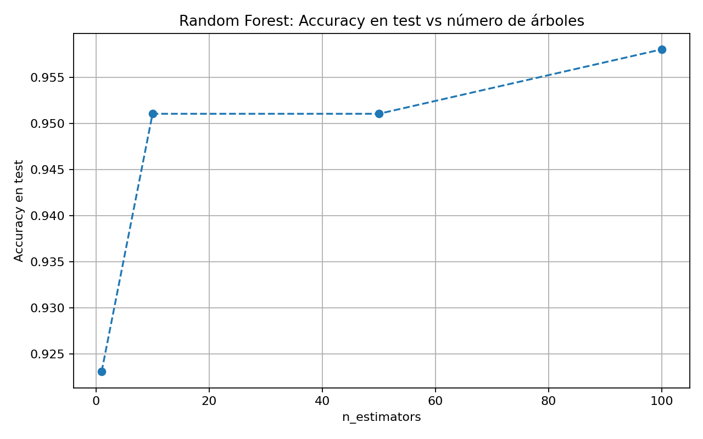

# Práctica 7: La Inteligencia Colectiva (Modelos de Ensambles)

## Introducción al Aprendizaje Automático
**3º Ingeniería Informática - Curso 2025/2026**

## Objetivo
Comprender por qué combinar múltiples modelos puede mejorar la capacidad de generalización frente a un clasificador individual. En particular, se estudiará el fenómeno del overfitting en árboles de decisión, el funcionamiento de estrategias de ensamble como Random Forest y Boosting, y la forma en que estos métodos logran reducir errores, estabilizar predicciones e identificar variables relevantes en un problema de clasificación real.

## Material de partida
Se proporciona lo siguiente:

- Un dataset real de clasificación, Breast Cancer Wisconsin, integrado en scikit-learn, por lo que no es necesario descargar ningún fichero externo.
- Una plantilla de código base en Python con scikit-learn y matplotlib, para facilitar la carga de datos, el entrenamiento de los modelos y la representación gráfica de resultados.
- Un problema de clasificación binaria con múltiples variables predictoras, apropiado para observar tanto el sobreajuste de un árbol individual como las ventajas de los métodos de ensamble.

## Nota
En esta práctica se proporciona una implementación base para acelerar la parte mecánica del trabajo. El objetivo no es construir desde cero los algoritmos de ensamble, sino entender qué problema intentan resolver, cómo se comportan frente a un árbol simple y qué información puede extraerse de sus resultados.

## Introducción
En muchos problemas reales, una única decisión tomada por un único modelo puede ser frágil. Un árbol de decisión sin restricciones, por ejemplo, puede adaptarse con enorme precisión a los datos de entrenamiento, pero esa misma flexibilidad puede convertirse en una debilidad cuando el modelo se enfrenta a ejemplos nuevos. Este fenómeno se conoce como sobreajuste u overfitting, y constituye uno de los problemas centrales del aprendizaje automático.

Una estrategia clásica para reducir este problema consiste en combinar múltiples modelos en lugar de confiar en uno solo. Esta idea da lugar a los métodos de ensamble, donde varios clasificadores cooperan para producir una predicción final más robusta. En lugar de depender de un único árbol potencialmente inestable, se construye un conjunto de árboles que votan, corrigen errores o reparten la carga de aprendizaje.

En esta práctica se trabaja con tres enfoques progresivos: un árbol de decisión simple, que sirve como línea base; un Random Forest, que combina múltiples árboles entrenados sobre distintas muestras de los datos; y un modelo de Boosting, que entrena árboles secuencialmente para corregir errores previos.

El objetivo es comprender no solo cuál obtiene mejor precisión, sino también por qué se comportan de forma distinta y qué compromisos existen entre capacidad predictiva, coste de entrenamiento, interpretabilidad y robustez.

## Configuración experimental
- Dataset: Breast Cancer Wisconsin (scikit-learn)
- Total de muestras: 569
- Número de variables: 30
- División: entrenamiento 75% y prueba 25% con partición estratificada
- Semilla: `random_state = 42`

## Tarea 1: El árbol solitario

### Qué se hizo
- Se cargó el dataset Breast Cancer Wisconsin proporcionado por scikit-learn.
- Se dividieron los datos en entrenamiento y prueba con estratificación.
- Se entrenó un `DecisionTreeClassifier` sin limitar su profundidad.
- Se evaluó el rendimiento en entrenamiento y prueba para detectar posibles signos de sobreajuste.

### Resultados
- Accuracy en entrenamiento: 1.0000
- Accuracy en test: 0.9231
- Matriz de confusión:
  - `[[49, 4], [7, 83]]`
- Informe de clasificación:
  - clase 0: precision 0.88, recall 0.92, f1-score 0.90
  - clase 1: precision 0.95, recall 0.92, f1-score 0.94

### Interpretación
El comportamiento observado es compatible con overfitting. El árbol alcanza una precisión perfecta en entrenamiento, pero baja en test, lo que indica que ha aprendido reglas demasiado ajustadas a los ejemplos vistos y no ha generalizado igual de bien a datos nuevos.

En un árbol muy profundo, cada partición divide el espacio de entrada en regiones cada vez más pequeñas. Eso permite ajustar casi cualquier conjunto de entrenamiento, pero también hace que el modelo sea muy sensible al ruido o a ejemplos particulares. En vez de capturar patrones generales, acaba construyendo reglas muy específicas que no siempre se repiten fuera del entrenamiento.

La lectura práctica es clara: una precisión alta en entrenamiento no garantiza un buen modelo, porque el rendimiento útil es el que se mantiene en datos no vistos.

## Tarea 2: Bagging y Random Forest

### Qué se hizo
- Se entrenó un `RandomForestClassifier` con distintos números de árboles.
- Se evaluó el rendimiento en test para `n_estimators = 1, 10, 50, 100`.
- Se registró el tiempo de entrenamiento de cada configuración.
- Se guardó la evolución del rendimiento para representarla gráficamente.

### Resultados del experimento

| Número de árboles | Accuracy test | Tiempo de entrenamiento (s) |
|---|---:|---:|
| 1 | 0.9231 | 0.0035 |
| 10 | 0.9510 | 0.0183 |
| 50 | 0.9510 | 0.0687 |
| 100 | 0.9580 | 0.1349 |

### Interpretación
Random Forest generaliza mejor que un árbol individual porque reduce la varianza. Cada árbol se entrena sobre subconjuntos distintos de ejemplos, y además las decisiones finales se combinan por votación. Eso hace que los errores de un árbol concreto se compensen, al menos en parte, con los de los demás.

La curva obtenida muestra una mejora clara al pasar de 1 a 10 árboles, pero después la ganancia se va estabilizando. Entre 10 y 50 árboles el resultado apenas cambia, y al llegar a 100 árboles solo aparece una mejora ligera. Esto sugiere que el ensamble ya ha capturado casi toda la mejora que podía aportar esta estrategia en este problema.

La razón es que, una vez que hay suficientes árboles, añadir más modelos aporta información muy parecida a la que ya estaba presente. La reducción de varianza sigue existiendo, pero el margen de mejora se vuelve pequeño frente al coste adicional de entrenar y almacenar más árboles.

### Variables más importantes en Random Forest
1. `worst area`
2. `worst concave points`
3. `mean concave points`

Estas variables son razonables, porque reflejan tamaño y forma del tumor, que son rasgos muy relacionados con la malignidad en este tipo de datos. El modelo no trata todas las variables por igual, sino que concentra más importancia en las que mejor separan las clases.

## Tarea 3: El poder del Boosting

### Qué se hizo
- Se entrenó un `GradientBoostingClassifier`.
- Se midió su accuracy en entrenamiento y test.
- Se comparó su tiempo de entrenamiento con el de Random Forest.
- Se extrajeron las variables más importantes según `feature_importances_`.

### Resultados
- Tiempo de entrenamiento: 0.3186 s
- Accuracy en entrenamiento: 1.0000
- Accuracy en test: 0.9580
- Matriz de confusión:
  - `[[48, 5], [1, 89]]`

### Variables más importantes en Gradient Boosting
1. `worst radius`
2. `worst concave points`
3. `worst perimeter`

### Interpretación
La diferencia conceptual entre Boosting y Bagging es importante. En Bagging, como en Random Forest, los modelos se entrenan de forma paralela e independiente sobre muestras distintas. En Boosting, en cambio, los modelos se construyen de forma secuencial: cada nuevo árbol intenta corregir los errores de los anteriores.

Eso explica por qué Boosting suele ser más sensible al entrenamiento y, en este caso, también más costoso que Random Forest. En la ejecución realizada, Boosting alcanzó la misma precisión final en test que Random Forest, pero tardó más en entrenarse.

Las tres variables más relevantes vuelven a ser coherentes con el problema: medidas de tamaño y contorno del tumor. No parece una selección arbitraria, sino una señal de que el modelo está capturando información útil para discriminar entre benigno y maligno.

## Tarea 4: Comparación global de los modelos

### Comparación final

| Modelo | Accuracy test | Sobreajuste | Coste de entrenamiento | Interpretabilidad |
|---|---:|---|---|---|
| Árbol simple | 0.9231 | Alto | Muy bajo | Muy alta |
| Random Forest | 0.9580 | Bajo | Medio | Media-baja |
| Gradient Boosting | 0.9580 | Bajo | Medio-alto | Media-baja |

### Interpretación
Un conjunto de modelos puede ser mejor que un único modelo aparentemente potente porque combina diversidad y agregación. Un árbol individual puede ser muy flexible, pero también muy inestable. En cambio, varios modelos juntos reducen el error de generalización al compensar los fallos individuales de cada uno.

El ejemplo más claro es Random Forest: cada árbol comete errores distintos, pero la votación conjunta suaviza esas decisiones y produce un resultado más robusto. Boosting sigue una filosofía distinta, ya que corrige secuencialmente errores previos y también mejora la capacidad predictiva.

### Inconvenientes de los ensambles
- Mayor coste computacional que un árbol simple.
- Menor interpretabilidad que un clasificador individual.
- Más dificultad para desplegar modelos grandes en entornos limitados.

En resumen, los ensambles mejoran la generalización, pero no son gratuitos: se paga con más complejidad, más tiempo de entrenamiento y menos transparencia.

## Reto: Pensando en el despliegue

### Elección del modelo
Si tuviera que integrar uno de estos modelos en una aplicación con recursos limitados, elegiría un árbol simple, idealmente podado o con profundidad controlada.

### Qué se gana
- Menor memoria ocupada.
- Inferencia muy rápida.
- Facilidad de explicación e implementación.
- Menor coste de mantenimiento.

### Qué se sacrifica
- Se pierde precisión frente a Random Forest y Boosting.
- Aumenta el riesgo de sobreajuste si no se controla la complejidad.
- La robustez frente a ruido es menor.

La idea importante es que el mejor modelo no siempre es el más preciso. En un entorno real también importan la latencia, el consumo de memoria y la simplicidad de despliegue.

## Conclusión
En esta práctica se ha visto que el rendimiento de un modelo depende mucho de su estructura. Un árbol de decisión muy profundo puede sobreajustar con facilidad, porque crea particiones demasiado específicas del espacio de entrada y termina aprendiendo detalles que no se repiten en datos nuevos.

Los ensambles mejoran claramente esa situación. Random Forest reduce la varianza al combinar árboles entrenados sobre distintas muestras, y Boosting construye modelos secuenciales capaces de corregir errores anteriores. Ambos alcanzan una precisión final de 0.9580 en test, superior a la del árbol simple.

También se ha observado que las variables más relevantes tienen sentido desde el punto de vista del problema: aparecen medidas asociadas al tamaño y la forma de la lesión, que son justamente atributos útiles para separar las clases.

En conjunto, la práctica confirma que combinar modelos simples puede ofrecer mejores predicciones que depender de un único clasificador muy flexible. Aun así, la elección final debe equilibrar precisión, coste computacional e interpretabilidad. Para un despliegue con recursos limitados, la opción más prudente es un árbol simple; para un escenario donde prima el rendimiento, Random Forest o Boosting son mejores alternativas.

## Artefactos generados
- `outputs/random_forest_accuracy.png`
- `outputs/random_forest_curve_results.csv`
- `outputs/random_forest_top_features.csv`
- `outputs/gradient_boosting_top_features.csv`
- `outputs/tabla_comparativa_modelos.csv`

