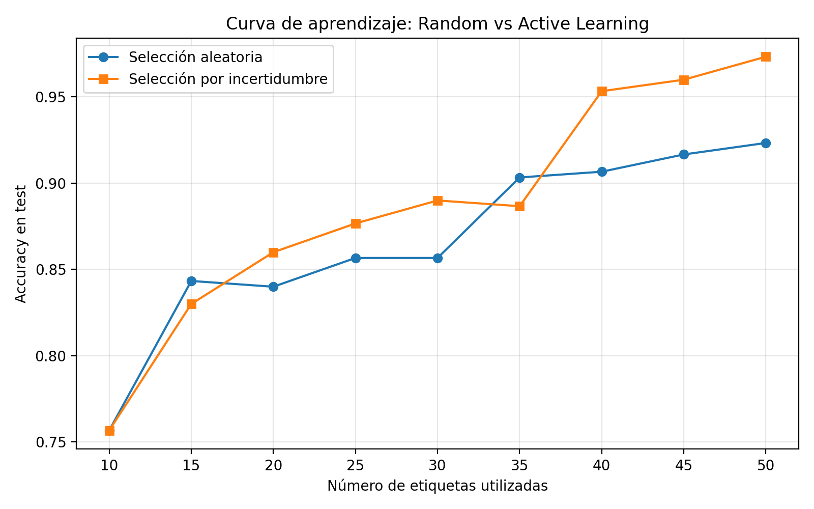

# Práctica 8: Active Learning (Aprendizaje Activo)

## Introducción al Aprendizaje Automático
**3º Ingeniería Informática - Curso 2025/2026**

## Objetivo
Comprender cómo un modelo puede aprender de forma más eficiente cuando no se etiquetan ejemplos al azar, sino que se seleccionan de manera inteligente aquellos datos que resultan más informativos. En particular, se estudiará el enfoque de Active Learning o Aprendizaje Activo, comparando una estrategia de etiquetado aleatorio frente a una estrategia basada en la incertidumbre del modelo. El objetivo final es analizar cómo maximizar el rendimiento de un clasificador cuando el número de etiquetas disponibles es limitado.

## Material de partida
Se proporciona lo siguiente:
- Un código base que prepara automáticamente un dataset sintético de clasificación binaria mediante `make_moons`.
- Un conjunto inicial de 10 puntos etiquetados.
- Un conjunto amplio de puntos no etiquetados, denominado pool.
- Un conjunto de test separado para evaluar el rendimiento del modelo.
- El vector de etiquetas reales, que actúa como oráculo durante el proceso de consulta.
- Una plantilla con las librerías necesarias para entrenar modelos, calcular probabilidades y representar gráficas.

## Introducción
En muchos problemas reales de aprendizaje automático, disponer de datos no suele ser el principal problema. Lo difícil, costoso o lento suele ser conseguir datos correctamente etiquetados. Por ejemplo, puede ser relativamente fácil recopilar miles de imágenes, señales o registros, pero etiquetarlos puede requerir la intervención de expertos.

En esta práctica se simula este escenario con un dataset sintético. Aunque conocemos todas las etiquetas verdaderas, el modelo solo puede acceder inicialmente a 10 etiquetas. El resto están ocultas para el modelo y únicamente se revelan cuando el algoritmo decide consultar esos puntos.

Una estrategia sencilla sería seleccionar nuevos ejemplos al azar. Sin embargo, esta selección puede ser poco eficiente, ya que algunos ejemplos pueden ser redundantes, muy fáciles o poco informativos. El Active Learning propone una idea diferente: dejar que el modelo indique qué ejemplos le resultan más útiles para aprender. Para ello, se seleccionan aquellos puntos sobre los que el modelo tiene mayor incertidumbre.

En esta práctica se comparan dos estrategias: una estrategia aleatoria, que selecciona nuevos ejemplos sin tener en cuenta el estado del modelo; y una estrategia de aprendizaje activo por incertidumbre, que selecciona los ejemplos cuya predicción está más cerca de la duda.

Partimos de una situación con pocas etiquetas iniciales y un presupuesto máximo de 50 etiquetas. La pregunta clave es si es mejor gastar el presupuesto de etiquetas al azar o usarlo en los ejemplos que más pueden ayudar al modelo.

## Tarea 1: Entrenamiento inicial

### Qué se hizo
- Se utilizaron los 10 ejemplos etiquetados iniciales proporcionados por el código base.
- Se entrenó un clasificador `RandomForestClassifier` con esas 10 etiquetas.
- Se evaluó el modelo sobre el conjunto de test separado.
- Se calculó el accuracy inicial para comprobar el punto de partida del aprendizaje.

### Resultado inicial
- Accuracy inicial con 10 etiquetas: **0.7567**

### Cuestión
¿Es fiable el rendimiento inicial del modelo?

No. Aunque el accuracy inicial no es despreciable, el modelo ha sido entrenado con muy pocos ejemplos y todavía no representa bien la distribución completa del problema. Con solo 10 etiquetas, algunas zonas del espacio de entrada quedan mal cubiertas y la frontera de decisión es muy inestable. Por eso, este rendimiento inicial no debe interpretarse como una estimación sólida de la capacidad real del clasificador.

### Análisis
Entrenar con solo 10 ejemplos etiquetados tiene varias limitaciones. El conjunto inicial puede no ser representativo, el resultado depende mucho de qué puntos concretos hayan sido elegidos y el modelo puede aprender una frontera de decisión demasiado sesgada. En estas condiciones, pequeños cambios en el conjunto etiquetado pueden alterar bastante el comportamiento del clasificador.

## Tarea 2: Estrategia baseline con selección aleatoria

### Qué se hizo
- Se partió de los mismos 10 ejemplos etiquetados iniciales.
- En cada iteración se seleccionaron aleatoriamente 5 ejemplos del pool no etiquetado.
- Se consultaron sus etiquetas reales usando el vector de etiquetas proporcionado.
- Se añadieron esos ejemplos al conjunto de entrenamiento y se eliminaron del pool.
- Se reentrenó el modelo y se evaluó sobre el conjunto de test.
- Se guardó el número de etiquetas utilizadas y el accuracy obtenido.
- Se repitió el proceso hasta alcanzar 50 etiquetas.

### Cuestión
¿Por qué esta estrategia constituye una línea base razonable?

La selección aleatoria es una buena línea base porque no usa ninguna información del modelo y representa la evolución del rendimiento al aumentar simplemente el número de etiquetas disponibles. Sirve como referencia para comprobar si una estrategia más inteligente, como Active Learning, consigue mejorar el aprendizaje con el mismo presupuesto de anotación.

### Resultados de la curva aleatoria
| Etiquetas usadas | Accuracy en test |
|---|---:|
| 10 | 0.7567 |
| 15 | 0.8433 |
| 20 | 0.8400 |
| 25 | 0.8567 |
| 30 | 0.8567 |
| 35 | 0.9033 |
| 40 | 0.9067 |
| 45 | 0.9167 |
| 50 | 0.9233 |

### Interpretación
La curva aleatoria mejora de forma razonable al aumentar las etiquetas, pero muestra oscilaciones porque no todos los puntos añadidos son igual de útiles. En algunos pasos el rendimiento apenas cambia, lo que indica que parte del presupuesto se gasta en ejemplos redundantes o poco informativos.

## Tarea 3: Ciclo de consulta mediante incertidumbre

### Qué se hizo
- Se partió de los mismos 10 ejemplos etiquetados iniciales.
- Se entrenó el modelo con las etiquetas disponibles.
- Se calcularon las probabilidades predichas sobre el pool no etiquetado.
- Se seleccionaron los 5 ejemplos más inciertos, es decir, los más cercanos a una probabilidad de 0.5.
- Se consultaron sus etiquetas reales usando el oráculo.
- Se añadieron esos ejemplos al conjunto de entrenamiento y se eliminaron del pool.
- Se reentrenó el modelo, se evaluó en test y se guardó el número de etiquetas y el accuracy.
- Se repitió el proceso hasta alcanzar 50 etiquetas.

### Cuestión
¿Por qué tiene sentido seleccionar los puntos más cercanos a la frontera de decisión?

Porque esos puntos son los que más información nueva pueden aportar. Si el modelo duda entre ambas clases, una nueva etiqueta puede ayudar a ajustar mejor la frontera de decisión. En cambio, un ejemplo muy fácil y muy alejado de la frontera suele confirmar algo que el modelo ya sabe y aporta menos valor informativo.

### Resultados de la curva por incertidumbre
| Etiquetas usadas | Accuracy en test |
|---|---:|
| 10 | 0.7567 |
| 15 | 0.8300 |
| 20 | 0.8600 |
| 25 | 0.8767 |
| 30 | 0.8900 |
| 35 | 0.8867 |
| 40 | 0.9533 |
| 45 | 0.9600 |
| 50 | 0.9733 |

### Interpretación
La estrategia por incertidumbre aprende con más rapidez a partir de las primeras consultas realmente informativas. Aunque también presenta pequeñas oscilaciones, termina alcanzando un rendimiento claramente superior al de la estrategia aleatoria con el mismo presupuesto de etiquetas.

## Tarea 4: Comparativa final mediante curva de aprendizaje

### Gráfica generada

### Cuestión
¿Qué estrategia obtiene mejor rendimiento con el mismo número de etiquetas?

La estrategia basada en incertidumbre obtiene mejor rendimiento global con el mismo número de etiquetas. No solo acaba en un accuracy mayor, sino que además aprovecha mejor las primeras consultas, porque elige puntos cercanos a la frontera de decisión. La selección aleatoria también mejora, pero parte del presupuesto se desperdicia en ejemplos poco informativos.

### Interpretación
La curva muestra que Active Learning no garantiza una mejora perfectamente monótona, pero sí suele ofrecer una ventaja clara cuando el número de etiquetas es limitado. En este experimento, la mejora más notable aparece a partir de 40 etiquetas, donde la estrategia por incertidumbre despega claramente y supera a la aleatoria con margen.

## Tarea 5: Reflexión sobre la frontera de decisión

### Pregunta de reflexión
¿Por qué el modelo aprende más rápido cuando elige puntos cercanos a la frontera de decisión?

Porque esos puntos son los más difíciles de clasificar y, por tanto, los más informativos. Su etiqueta ayuda a ajustar con más precisión la frontera de decisión, mientras que los puntos muy alejados suelen confirmar decisiones ya conocidas. En un escenario con presupuesto limitado, concentrar las consultas en las zonas de duda permite aprender más con menos etiquetas.

### Análisis crítico
Esta estrategia también tiene limitaciones. Si el modelo inicial está mal entrenado, su estimación de incertidumbre puede no ser fiable. Además, seleccionar siempre los puntos más inciertos puede hacer que el conjunto etiquetado sea poco representativo de la distribución global, lo que puede afectar a la generalización.

## Reto: Pensando en un problema real

### Estrategia elegida
En un escenario real con presupuesto limitado, elegiría Active Learning basado en incertidumbre como estrategia principal, posiblemente combinado con cierta exploración aleatoria para evitar sesgos excesivos.

### Ventajas
- Permite aprovechar mejor cada etiqueta consultada.
- Suele mejorar más rápido que la selección aleatoria cuando las anotaciones son caras.
- Se centra en ejemplos cercanos a la frontera, que son los que más ayudan a refinar el modelo.

### Riesgos o limitaciones
- Depende de que el modelo inicial ofrezca una incertidumbre razonable.
- Puede seleccionar ejemplos demasiado parecidos entre sí si la frontera está muy concentrada.
- Si el modelo arranca mal, puede consultar puntos poco representativos y sesgar el aprendizaje.

### Si el modelo inicial estuviera muy mal entrenado
La incertidumbre podría guiar mal el proceso de consulta. El modelo podría considerar inciertos puntos que no son realmente los más útiles o ignorar regiones importantes del espacio de entrada. En ese caso, una estrategia puramente basada en incertidumbre podría rendir peor que una mezcla con selección aleatoria.

### ¿Puede Active Learning seleccionar ejemplos poco representativos?
Sí. Si solo se centra en la incertidumbre, puede concentrarse demasiado en una zona concreta de la frontera y dejar sin explorar otras regiones del espacio. Por eso, en problemas reales suele ser útil combinar incertidumbre con diversidad o con una pequeña componente aleatoria.

## Conclusión
Esta práctica muestra que el aprendizaje automático no depende solo del modelo, sino también de cómo se construye el conjunto de entrenamiento. Con un presupuesto limitado de etiquetas, seleccionar ejemplos informativos puede ser mucho más eficiente que etiquetar puntos al azar.

En los resultados obtenidos, la estrategia por incertidumbre supera claramente a la aleatoria, alcanzando un accuracy final de 0.9733 frente a 0.9233 con el mismo número de etiquetas. Esto confirma que los puntos cercanos a la frontera de decisión aportan más información para mejorar el clasificador.

Aun así, Active Learning no es una solución mágica: depende de la calidad del modelo inicial, de la fiabilidad de la incertidumbre y de que los ejemplos consultados mantengan cierta representatividad. Bien utilizado, puede reducir mucho el coste de anotación y mejorar el rendimiento más rápido que una estrategia aleatoria.

