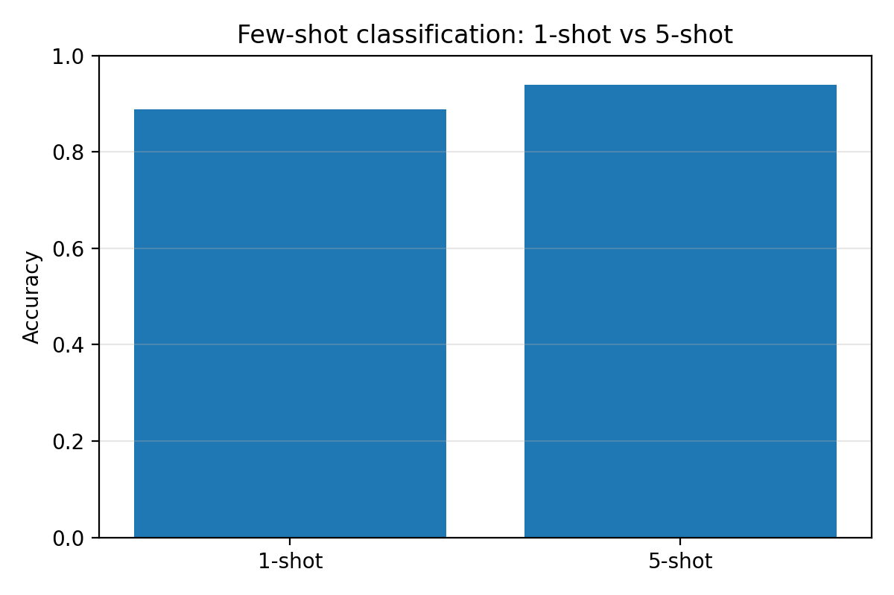
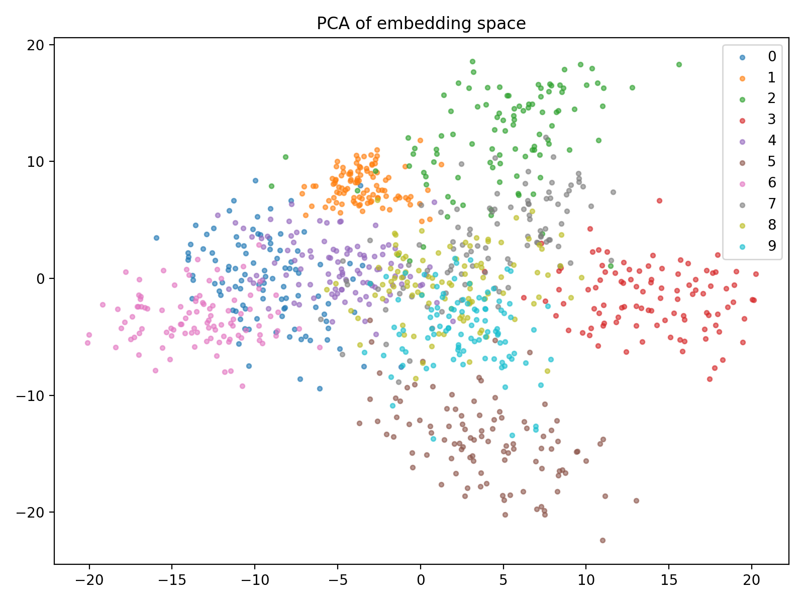

# Práctica 9: Few-shot Learning

## Aprendizaje con Pocos Ejemplos
**3º Ingeniería Informática - Curso 2025/2026**

---

## Objetivo
Comprender cómo un modelo puede reconocer una clase nueva utilizando muy pocos ejemplos etiquetados. En particular, se estudiará el enfoque de Few-shot Learning mediante una versión sencilla de Redes Prototípicas aplicada al dataset MNIST. El objetivo final será analizar si un modelo entrenado sin ver una clase concreta puede reutilizar su extractor de características para representar esa clase nueva mediante un pequeño conjunto de ejemplos de apoyo.

---

## Material de partida
Se proporciona lo siguiente:
- Un código base que carga automáticamente el dataset MNIST.
- Una división del problema en un mundo sin sietes, donde el modelo se entrena inicialmente sin imágenes de la clase 7.
- Una red neuronal sencilla que actúa primero como clasificador y posteriormente como extractor de características (embedding).
- Un support set con pocos ejemplos del dígito 7.
- Un query set con ejemplos de test para evaluar si el modelo reconoce correctamente la nueva clase.
- Funciones auxiliares para calcular prototipos, distancias euclídeas y precisión.
- Una plantilla con las librerías necesarias para entrenar el modelo, obtener embeddings y representar resultados.

---

## Introducción
En muchos problemas reales de aprendizaje automático no siempre se dispone de cientos o miles de ejemplos etiquetados para cada clase. En ocasiones aparece una clase nueva de la que solo tenemos unas pocas muestras: una nueva especie animal, un defecto raro en una cadena de producción, una enfermedad poco frecuente o una categoría visual que el sistema no había visto antes.

Una solución ingenua sería reentrenar el modelo completo con esos pocos ejemplos. Sin embargo, esto suele ser poco fiable: con tan pocos datos, el modelo puede sobreajustarse y no aprender una representación general de la nueva clase. Además, si se reentrena de forma inadecuada, puede empeorar su rendimiento sobre las clases que ya conocía.

El Few-shot Learning propone una idea distinta: en lugar de aprender una nueva clase desde cero, se intenta aprovechar una representación ya aprendida. En esta práctica, entrenaremos primero una red neuronal con los dígitos de MNIST excepto el 7. Después eliminaremos su última capa y usaremos la red como extractor de características. De esta forma, cada imagen se convertirá en un vector numérico o embedding.

A partir de unos pocos ejemplos del número 7, calcularemos un prototipo: el vector medio de sus embeddings. Para clasificar nuevas imágenes, calcularemos qué prototipo queda más cerca en el espacio de características.

La pregunta clave será: **¿puede un modelo reconocer una clase nueva usando solo 1 o 5 ejemplos?**

---

## Conceptos clave
En esta práctica se utilizarán tres ideas fundamentales:
- Support set: pequeño conjunto de ejemplos etiquetados que se usa para definir una clase nueva.
- Query set: conjunto de ejemplos que se desea clasificar después de construir los prototipos.
- Prototipo: representación media de una clase en el espacio de embeddings.

Para una clase $k$, su prototipo se calcula como:

$$
c_k = \frac{1}{|S_k|} \sum_{x_i \in S_k} f(x_i)
$$

Donde $S_k$ es el conjunto de apoyo de la clase $k$ y $f(x_i)$ es el embedding producido por el extractor de características.

Una imagen de consulta se clasifica asignándola a la clase cuyo prototipo esté más cerca:

$$
\hat{y} = \arg\min_k d(f(x), c_k)
$$

En esta práctica utilizaremos distancia euclídea.

---

## Configuración experimental
Completa esta tabla con los valores reales obtenidos al ejecutar el código.

| Elemento | Valor |
|---|---|
| Dataset | MNIST |
| Tamaño de imagen | [28 x 28] |
| Clase nueva | [7] |
| Clases conocidas | [0, 1, 2, 3, 4, 5, 6, 8, 9] |
| Tamaño del support set | Pendiente de Tareas 3-5 |
| Tamaño del query set | Pendiente de Tareas 3-5 |
| Arquitectura del clasificador | CNN con 2 capas Conv2D + MaxPooling, Flatten, Dense(64, `embedding`) y Dense(9, softmax) |
| Dimensión del embedding | 64 |

---

## Tarea 1: Preparación del mundo sin sietes

### Qué se hizo
- Se cargó el dataset MNIST.
- Se normalizaron las imágenes para que los valores quedaran en el rango $[0,1]$.
- Se añadió un canal final para trabajar con imágenes de forma $(28, 28, 1)$.
- Se separaron del entrenamiento todas las imágenes del dígito 7.
- Se entrenó una red neuronal sencilla usando únicamente las clases conocidas.
- Se evaluó el clasificador sobre las clases conocidas.
- Se guardó el modelo entrenado.

### Resultados
Completa esta tabla con los resultados obtenidos.

| Métrica | Valor |
|---|---:|
| Accuracy sobre clases conocidas | 0.9879 |
| Loss final | 0.0403 |
| Épocas de entrenamiento | 3 |
| Ruta del modelo guardado | `outputs/classifier_known_classes.h5` |

### Cuestión: ¿Por qué tiene sentido eliminar la clase 7 durante el entrenamiento inicial?

Tiene sentido porque la clase 7 es la clase nueva que se quiere evaluar después con few-shot learning. Si el modelo la viera durante el entrenamiento inicial, ya no sería un problema de reconocimiento de clase nueva, sino un clasificador convencional. Al excluirla, se fuerza al modelo a aprender una representación útil para las clases conocidas sin adaptar directamente sus pesos al 7.

### Interpretación
<strong>¿Qué implica para el aprendizaje posterior que el modelo no haya visto nunca la clase 7?</strong>

Que el modelo no haya visto nunca el 7 significa que no ha ajustado sus pesos para separar explícitamente esa clase. Por tanto, al incorporarla después solo con unos pocos ejemplos, no se espera que la reconozca por una regla aprendida directamente, sino por similitud en el espacio de embeddings. Esto hace que la calidad del extractor de características sea clave para que el aprendizaje posterior funcione.

---

## Tarea 2: Construcción del extractor de características

### Qué se hizo
- Se tomó el modelo entrenado en la tarea anterior.
- Se identificó una capa intermedia adecuada para usarla como representación de la imagen.
- Se construyó un nuevo modelo que recibe una imagen y devuelve su embedding.
- Se obtuvieron embeddings para algunas imágenes de ejemplo.
- Se comprobó la dimensión del vector generado.

### Resultados
Completa los datos observados.

| Elemento | Valor |
|---|---:|
| Capa elegida como embedding | `embedding` |
| Dimensión del embedding | 64 |
| Ejemplo de embedding | Vector representativo de 64 componentes generado por la capa `embedding` |

### Cuestión: ¿Por qué no usamos directamente los píxeles de la imagen para calcular las distancias?

Porque los píxeles están en un espacio de alta dimensión y no capturan directamente la similitud semántica entre dígitos. Dos imágenes de un mismo número pueden verse muy distintas a nivel de píxel, mientras que el embedding intenta agrupar juntas las imágenes parecidas en una representación más compacta y estable para medir distancias.

### Interpretación
<strong>¿Por qué el espacio de embeddings suele ser más útil que el espacio original de píxeles? </strong>

El espacio de embeddings suele ser más útil porque concentra información relevante y reduce ruido visual irrelevante. Así, las distancias entre puntos reflejan mejor relaciones de clase que la comparación directa entre intensidades de píxeles.

---

## Tarea 3: Cálculo del prototipo del número 7

### Qué se hizo
- Se seleccionó 1 imagen del número 7 para construir un prototipo 1-shot.
- Se seleccionaron 5 imágenes del número 7 para construir un prototipo 5-shot.
- Se pasaron esas imágenes por el extractor de características.
- Se calculó el vector medio de los embeddings seleccionados.
- Se guardaron ambos prototipos.

### Resultados
Completa esta tabla.

| Configuración | Número de ejemplos | Dimensión del prototipo | Observaciones |
|---|---:|---:|---|
| 1-shot | [1] | [inserta valor] | [inserta observación] |
| 5-shot | [5] | [inserta valor] | [inserta observación] |
| Ruta del prototipo 1-shot | [inserta ruta] |  |  |
| Ruta del prototipo 5-shot | [inserta ruta] |  |  |

### Cuestión: Explica qué representa el prototipo de una clase en cada uno de los casos.

[responde aquí]

### Interpretación
[explica qué cambia entre usar un solo ejemplo y usar varios]

---

## Tarea 4: Clasificación por distancia

### Qué se hizo
- Se construyeron prototipos para varias clases conocidas usando pocos ejemplos por clase.
- Se añadió también el prototipo del número 7.
- Se seleccionó un query set con imágenes de test.
- Se obtuvo el embedding de cada imagen de consulta.
- Se calculó la distancia euclídea entre cada query y cada prototipo.
- Se asignó a cada query la clase del prototipo más cercano.
- Se calculó la precisión obtenida.

### Resultados
Completa la tabla.

| Clase | Número de prototipos | Prototipo usado | Observaciones |
|---|---:|---|---|
| Clases conocidas | [inserta valor] | [inserta descripción] | [inserta observación] |
| Clase nueva 7 | [1] | [prototipo 1-shot / 5-shot] | [inserta observación] |

| Métrica | Valor |
|---|---:|
| Accuracy final | [inserta valor] |

### Cuestión: Explica por qué clasificar por distancia puede funcionar en un espacio de embeddings.

[responde aquí]

### Interpretación
[explica qué significa que dos clases estén cerca o lejos en el espacio de características]

---

## Tarea 5: Comparación entre 1-shot y 5-shot

### Qué se hizo
- Se ejecutó la clasificación usando prototipos construidos con 1 ejemplo por clase.
- Se ejecutó la clasificación usando prototipos construidos con 5 ejemplos por clase.
- Se evaluaron ambos casos sobre el mismo query set.
- Se guardó la accuracy de cada configuración.
- Se representó una gráfica de barras comparando 1-shot y 5-shot.

### Resultados
Completa la tabla comparativa.

| Configuración | Accuracy | Observaciones |
|---|---:|---|
| 1-shot | [inserta valor] | [inserta observación] |
| 5-shot | [inserta valor] | [inserta observación] |

### Cuestión: ¿Mejora el rendimiento al pasar de 1-shot a 5-shot? ¿Por qué?

[responde aquí]

### Figura comparativa
Inserta aquí la gráfica de barras generada.

### Interpretación
[explica qué mejora y qué limitaciones siguen presentes]

---

## Tarea 6: Visualización del espacio de características

### Qué se hizo
- Se obtuvieron embeddings de un subconjunto de imágenes de test.
- Se aplicó PCA o t-SNE para proyectarlos a dos dimensiones.
- Se representaron los puntos coloreados por clase.
- Se marcaron, si fue posible, las posiciones de los prototipos.
- Se observó si el número 7 queda cerca o lejos de otros dígitos.

### Figura
Inserta aquí la visualización del espacio de embeddings.

### Cuestión: Explica qué aporta esta visualización para entender el método.

[responde aquí]

### Interpretación
[describe si el 7 aparece separado, mezclado o cerca de clases concretas]

---

## Limitaciones del enfoque

### Qué se debe comentar
- dependencia de la calidad del extractor de características;
- sensibilidad a que el support set no sea representativo;
- posible solapamiento entre clases en el espacio de embeddings;
- diferencia entre 1-shot y 5-shot en términos de robustez;
- limitaciones de usar una única distancia para decidir la clase.

### Reflexión
[explica aquí por qué el método funciona bien o mal según el caso]

---

## Reto: Pensando en un problema real

Imagina que trabajas en una aplicación de reconocimiento visual y aparece una nueva categoría para la que solo tienes unas pocas imágenes etiquetadas.

### Cuestiones
Responde razonadamente a las siguientes preguntas:

1. ¿Qué ventajas tendría usar un extractor de características preentrenado?

   [responde aquí]

2. ¿Qué riesgos existen si los pocos ejemplos del support set no son representativos?

   [responde aquí]

3. ¿Qué ocurriría si el extractor no genera buenos embeddings para la nueva clase?

   [responde aquí]

4. ¿Por qué el enfoque 5-shot puede ser más robusto que el enfoque 1-shot?

   [responde aquí]

5. ¿En qué tipo de problemas reales podría ser útil esta estrategia?

   [responde aquí]

### Interpretación
El objetivo de esta parte es entender que Few-shot Learning no consiste simplemente en entrenar con pocos datos. La clave está en reutilizar una representación aprendida previamente y clasificar nuevas clases mediante comparación en un espacio de características.

---

## Conclusión
Redacta aquí una conclusión razonada sobre lo aprendido en la práctica.

Pistas para la conclusión:
- qué significa aprender con pocos ejemplos;
- qué diferencia hay entre entrenamiento supervisado convencional y Few-shot Learning;
- qué es un support set y qué es un query set;
- qué representa un prototipo;
- por qué se clasifican las imágenes por distancia;
- por qué 5 ejemplos pueden ser mejores que 1;
- qué limitaciones tiene depender de un extractor de características previamente entrenado.

